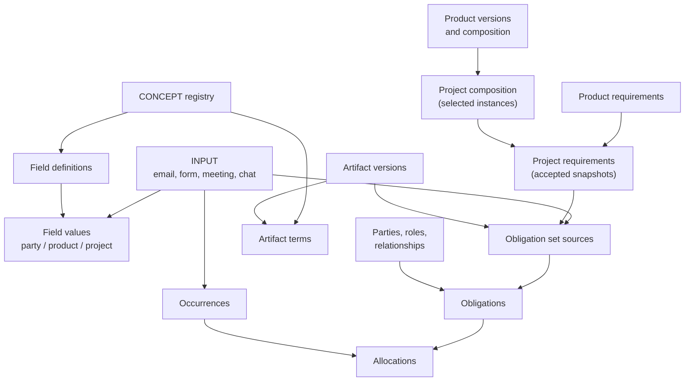

# Eskwelabs operational data architecture — onboarding package

Build v3.1, 13 September 2026. This package lets anyone stand up a complete local copy of the architecture in a few minutes and understand what each part is for. It combines what were previously five separate artefacts: reference schema v3 (the five core domains plus the field/value extension), the `BE_ilog_concepts` semantic registry, the `BE_ilog_artifacts` artifact registry, and the INPUT record that the domain model kept referring to but never defined.

| File | What it is |
|---|---|
| `esk_local_setup.sql` | One script: schema (31 tables, 18 views, guards), the real concept registry as seed data, and a small synthetic demo. |
| `README.md` | This file: what the domains mean, how they connect, how to install, how to work with the data, what the database does and does not enforce. |
| `data_dictionary.md` | Every table, column, key, constraint, view and trigger, generated from the live catalog after running the script. |

The database is the structural foundation of a workflow engine, not the engine itself. Read "Workflow contracts" before writing any automation against it.

## 1. Install a local copy

You need PostgreSQL 15 or newer (16 was used to validate this build). Every object reference in the script is schema-qualified, so it does not depend on `search_path` and runs the same way in the three environments people actually use.

**With psql, one session — recommended, and the only way you get rollback:**

```sh
createdb esk_local
psql -v ON_ERROR_STOP=1 -d esk_local -f esk_local_setup.sql
psql -d esk_local -c "select count(*) as tables from pg_tables where schemaname='esk_core_v3';"
```

**In the Supabase SQL editor or a similar console:** paste the whole file and run it. This also works against a hosted Supabase project; you need a role that can `CREATE SCHEMA` (the `postgres` role can).

**Through a runner that executes statements one at a time** (the Supabase MCP `execute_sql` tool, some migration tools): this works too, but each statement commits on its own, so a failure leaves a partial schema behind rather than rolling back. Clean up with `DROP SCHEMA esk_core_v3 CASCADE;` and run it again.

You should see 31 tables. The script is three sections: Section A creates schema `esk_core_v3`; Section B loads the registry; Section C loads a synthetic demo. The `BEGIN`/`COMMIT` pairs make each section all-or-nothing in the first two cases; in the third they are no-ops that emit a warning you can ignore. Running the script twice fails on `CREATE SCHEMA` rather than silently reusing the namespace. There are no DROP statements in the script itself. If you want an empty install without example data, delete Section C (everything after the `SECTION C` banner) before running.

All three execution paths were verified to produce a byte-identical catalog (`pg_dump --schema-only` diff) and identical seeded row counts.

The schema enables row-level security on every table and grants nothing to PUBLIC. Locally you connect as the database owner, so this has no effect; in a deployment, application roles must be granted explicitly, and the presence of a `party_role` row never implies database access.

For querying afterwards, set `search_path` to `esk_core_v3` in your session (`set search_path = esk_core_v3;`) or qualify names. The example queries below assume you have done this; in a SQL console that runs each query in a new session, qualify the names or repeat the `set` in the same call.

## 2. The model in one paragraph

A **party** is a person or organization. The **catalog** describes reusable work as products, exact product versions, and compositions of versions. A **project** is the operating context in which exact versions are selected and configured. Reusable **product requirements** are resolved into accepted **project requirements**, which are admitted as **sources** into an **obligation set**, from which atomic **obligations** are instantiated: who owes what to whom, by when, on what authority. **Occurrences** are immutable facts (a session delivered, a payment received, a report accepted); **allocations** say which fact contributes to which obligation, and fulfillment is derived from them rather than stored. **Inputs** are the canonical records of information entering the system and are the provenance root cited by assertions, sources and occurrences. **Artifacts** are produced information objects with immutable versions. **Concepts** are the shared vocabulary that field definitions, artifact terms and controlled values point at. Configurable business attributes of parties, products and projects live in a shared **field/value** structure rather than in ever-widening tables.



## 3. Table budget and ownership

| Domain | Tables | Count | Operating owner |
|---|---|---:|---|
| Parties | `party`, `party_identifier`, `party_role`, `party_relationship` | 4 | Operations / relationship steward |
| Concepts | `concept`, `concept_relationship`, `concept_id_migration` | 3 | Data steward (registry owner) |
| Inputs | `input` | 1 | Ingestion workflow, with triage review |
| Products | `product`, `product_version`, `product_composition`, `product_requirement` | 4 | LXD / product owner |
| Projects | `project`, `project_composition`, `project_requirement` | 3 | Delivery / project owner |
| Artifacts | `artifact`, `artifact_template`, `artifact_version`, `artifact_term`, `artifact_relationship` | 5 | Whoever owns the artifact; templates by LXD/growth |
| Obligations | `obligation_set`, `obligation_set_party`, `obligation_set_source`, `obligation`, `obligation_source` | 5 | Delivery, finance or engagement owner |
| Occurrences | `occurrence`, `obligation_occurrence` | 2 | Source workflow, exception review by operations |
| Field / value | `field_definition`, `party_field_value`, `product_field_value`, `project_field_value` | 4 | Technical steward for definitions; domain owners for values |
| **Total** | | **31** | One technical steward maintains the common model |

Ownership means responsibility for data quality and rule approval. Tickets, workflow execution, raw ingestion (`raw`/`stg` email tables) and agreements-as-tables are outside this namespace by design; the domain model treats a signed agreement as an artifact version admitted as an obligation source, not as its own primitive.

## 4. Domain by domain

### Parties

One enduring `party` row per person or group, with `party_kind` and `organization_form` covering people, legal entities, teams and communities without subtype tables. Identity matching lives in `party_identifier` with issuer-and-account namespaces (`crm:main:contact_id`, `hris:ph:employee_id`, `email:work`); only verified identifiers are unique within a namespace, and an email address is a contact clue until verified. `party_role` is a contextual capacity (core_instructor for project A, product_advisor for a product, or global); `party_relationship` is a directed edge between two parties (member_of, advisor_to). Neither carries rates, fees or attendance; those are obligations and occurrences.

`party_relationship` rows with `relationship_type = 'counterparty'` do double duty: they are the stable owner-counterparty anchor for counterparty-scoped field values (see section 5). Direction matters: `subject_party_id` is the owner (the PH or SG contracting entity), `object_party_id` is the party treated as that owner's counterparty. A pair that already carries assertions cannot change its parties. The `counterparty` view exposes these rows with the workbook's column names.

`party.features` (and `project.features`, `party_relationship.features`) remain only as legacy JSON payloads for records migrated from the workbooks. New configurable attributes go into field values; do not dual-write.

### Concepts (semantic registry)

`concept` is the shared vocabulary, seeded from `BE_ilog_concepts` at workbook version 0.19.0: 603 concepts of four types. A `field` concept is a reusable attribute or the root of a value family (`delivery_mode`, `role_type`, `address_type`); a `vocabulary_value` is a controlled member linked to its family through `master_concept_id` (`delivery_mode_blended`); a `measure` is a metric (`net_promoter_score`); an `entity_class` names a polymorphic reference target (`entity_class_project`). `concept_key` is the stable join key and is immutable after publication; UUIDs are preserved from the workbook so cross-workbook references keep working. `concept_relationship` stores typed edges whose predicate is itself a concept under `concept_relationship_type` (is_a, replaced_by, default_execution_allocation, ...). `concept_id_migration` records the 125 duplicate UUIDs that were collapsed in repair 0.9.0 so old references can be rewritten.

Useful views: `v_concept_value_set` lists every (family, permitted value) pair; `v_concept_edge` shows relationships with readable keys.

```sql
set search_path = esk_core_v3;
select value_key, value_name from v_concept_value_set where field_key='delivery_mode';
select from_key, predicate, to_key from v_concept_edge where predicate like '%replaced_by';
```

The workbook stays the SSOT for concepts until the Postgres registry is declared authoritative; regenerate Section B from the workbook when it changes (the section ends with a row-count assertion so a stale export fails loudly).

### Inputs

`input` is the canonical record of information entering the system: one row per email message, form response, meeting note, chat message, website signup or manual entry. It was a bare `input_id` UUID in v2/v3; it is now a real table, and every column that referenced it (`obligation_set_source.input_id`, `*_field_value.source_input_id`, and a new `occurrence.source_input_id`) is a real foreign key.

The design is deliberately generic, as requested: `input_type` says what kind of record it is, `input_source` says which system and account emitted it (`gmail:ops@eskwelabs.com`, `google_forms:<form_id>`), `source_native_id` is the record's id in that system, and `input_value` is the payload as received. `(input_source, source_native_id)` is unique, so re-running an ingestion is idempotent. The payload and provenance columns are immutable and rows cannot be deleted; only `status`, `sensitivity`, `notes` and supersession can change. Correct a bad input by inserting a successor with `supersedes_input_id` and a reason. `sensitivity` (none, personal, hr, legal, financial_restricted, board) is the hook for access policy; the email pipeline design's tripwire that no board/hr/legal input reaches shared tables applies here.

Source-specific detail (email headers, recipients, transcript text) belongs in subtype tables keyed by `input_id` when those pipelines are built, exactly as the architecture document's `INPUT ├── EMAIL_MESSAGE ...` sketch shows; they are not part of this namespace yet. `v_input_usage` shows what each input ended up supporting.

Inputs answer "what information entered the system and where did it come from?". They do not by themselves change any business record: a validated input becomes field assertions, obligation sources or occurrences through the controlled operations below, each citing the input.

### Products

`product` is a stable catalog identity, including non-sellable internal packages (`standalone_sellable=false`). `product_version` is an exact edition; anything live pins an exact version, never "latest". `product_composition` places a child version inside a parent version with a `placement_key`, so a module reused by ten programs keeps one definition and the same child can appear twice in one parent. Composition must be acyclic; the publication workflow checks that. `product_requirement` is one registry for type defaults, version-specific rules and placement exceptions, with exactly one scope per row and `add`/`replace`/`suppress` actions on a `requirement_key`. Its `specification` is a declarative rule (quantity rule, unit, due rule, obligor role, acceptance criteria); never store executable code in it.

Business terms about products are field values (section 5): a delivery mode, a nominal cohort size, a draft rate. `configuration_schema` stays a technical schema of permitted configuration. "Submit one final report" is a requirement; `delivery_mode=blended` is a field value; a particular client's payable amount is an obligation.

### Projects

`project` gives planned or active work a stable identity across the commercial and delivery lifecycle: an opportunity becomes a client project without changing `project_id`. `parent_project_id` supports cohort → sprint → session hierarchies where a child needs its own owner, dates or requirements. `project_composition` (renamed from `project_product_instance` to follow the workbook naming) is one selected or proposed use of an exact product version; `instance_key` (`root_1`, `root_1/session_2`) lets the same sprint be delivered twice in one engagement. Root entries have no parent; child entries record the parent entry and the exact catalog placement, and the database verifies both belong to the same project and that the placement really supplies that child version. `project_requirement` is the materialized, accepted result of resolving catalog rules for one scope (`scope_key` = `project`, `instance:<uuid>`, `event:<uuid>`), with the full lineage in `resolution_snapshot` and only one accepted revision per project/scope/key.

Project attributes such as venue or a selected cohort size are project field values, at whole-project or single-composition scope.

### Artifacts

Seeded structure from `BE_ilog_artifacts` (no rows are seeded; the workbook's rows are real client records). `artifact` is a logical business output; `artifact_version` is an immutable manifestation with file location, template lineage and creator, unique on `(artifact_id, version_number)`. `artifact_term` attaches concept-linked typed properties to a version (programme duration, currency, scope exclusions) with the same exactly-one-typed-column rule as field values; `term_value` is the JSON serialization maintained by trigger for generic consumers. `artifact_relationship` links a version to a project, party, product, another artifact, a session (occurrence) or a role; it is a polymorphic logical key, resolved by trigger for every entity type that lives in this namespace and left unverified for `ticket` and `agreement`. `artifact_template` versions the reusable templates that generate artifacts.

A signed contract or accepted proposal is an artifact version; its payment, delivery and output terms become obligations through `obligation_set_source.artifact_version_id`. Do not create an agreement table to copy those facts.

### Obligations

`obligation_set` bundles requirements that are governed and changed together (a client delivery, an instructor engagement, a standing policy with no project). `obligation_set_party` records set-level context roles (signatory, contracting_party, approver). `obligation_set_source` admits exactly one concrete governing source per row: a project requirement, a product requirement, an input, or an artifact version, with role (baseline, supplementary, override, amendment), status, authority and an immutable `source_snapshot`. `obligation` is one atomic expected outcome with explicit obligor and beneficiary and one of four outcome shapes:

| Outcome | Required fields | Example |
|---|---|---|
| financial_transfer | `required_amount`, `currency_code` | Client pays PHP 90,000 |
| service_performance | `required_quantity`, `unit_code` | Deliver two sessions |
| artifact | `required_quantity`, `unit_code`, acceptance criteria in the governing specification | Submit one accepted report |
| condition_state | `expected_condition`, `condition_mode`; a period for maintained conditions | Accreditation stays active for the month |

Three states are independent: `lifecycle_status` (draft, active, cancelled, superseded, closed), `maturity_status` (contingent, mature, expired), and the derived `fulfillment_state` in `v_obligation_progress`. Closing a record does not fulfil it. `obligation_source` records, per attribute, which admitted source controlled the value; at most one controller per attribute, and the composite keys make cross-set provenance impossible. Revise by superseding the same `obligation_key` within the set.

### Occurrences

`occurrence` is an immutable fact: one row per session delivered, payment received, report accepted, attendance observed. `(source_system, source_record_id, source_event_key)` deduplicates ingestion. UPDATE, DELETE and TRUNCATE are rejected; correct by appending a successor with `supersedes_occurrence_id` and a reason, or a void successor. `obligation_occurrence` allocates a fact's quantity, amount or condition evidence to an obligation; the trigger checks outcome, unit or currency and reversal shape. Mistaken allocations are reversed with `reverses_allocation_id`, never edited. `v_current_occurrence`, `v_current_allocation` and `v_obligation_progress` apply these rules so nobody has to remember them in ad hoc SQL.

## 5. The field/value structure

Configurable business attributes are not columns. One physical registry, `field_definition`, defines every field for three domains and seven scopes; three physical value tables hold assertions with real foreign keys into their domain.

| Domain | Scopes | Value table | Target columns |
|---|---|---|---|
| party | `party`, `counterparty` | `party_field_value` | `party_id` or `party_relationship_id` (exactly one) |
| product | `product`, `product_version`, `product_composition` | `product_field_value` | exactly one of the three ids |
| project | `project`, `project_composition` | `project_field_value` | `project_id`, optionally narrowed by `project_composition_id` |

A definition has one scope. If the same label is useful at party and counterparty scope, register two definitions and link them to one concept. The definition's `value_type` and `cardinality` are copied onto every assertion and enforced by a composite foreign key, so a numeric field cannot receive text and a project field cannot land in the party table. Exactly one typed value column is populated. `value_key` is the slot: `single` for single-valued fields, or names like `work`, `billing_1` for multiple values, each row one complete item (one whole address object, one email address; never a concatenated list).

Time and status: `valid_from`/`valid_to` is the business interval with an exclusive upper bound; `recorded_at` is when it was written; `status` is proposed, accepted or retracted. Retraction means the assertion was wrong; closing `valid_to` means it stopped applying. For a normal change, close the old accepted row and insert the replacement in one transaction, preserving the old value and its source. Zero and false are values; missing facts have no accepted row; SQL NULL is never "known to be null". The `v_*_field_current` views apply status and dates for you.

Counterparty scope preserves the `BE_ilog_parties` idea that some facts belong to a specific business relationship: Example Client's payment terms with Demo Provider PH are 30 days and with Demo Provider SG are 45 days, two values of one counterparty field on two pair anchors, neither overwriting the client's own profile. Do not fall back from counterparty defaults to party facts unless a field's semantics explicitly allow it.

Concept-valued fields are where the registry earns its keep: a field whose `concept_id` is a value family (`delivery_mode`) only accepts `value_concept_id`s that are children of that family; the admission trigger enforces it. Categorical workbook values without a verified concept mapping migrate as `text`; do not invent concept UUIDs.

What replaced the old name, address and channel tables: simple names are text fields (`name.preferred`, `name.first`); structured legal names are JSON fields with a slot per jurisdiction; addresses are one JSON object per slot (`address.postal` with `billing_1`, `registered`); channels are text fields with the purpose in the slot key (`channel.email` / `work`), normalized value in `value_text`, original in `source_value_raw`; suppression preferences are booleans (`contact.do_not_email`) that sending workflows must read live. `party_identifier` stays reserved for verified identity; a stored email channel is not an identity. `party.display_name` remains the canonical display label.

Section C of the script seeds twelve starter field definitions as an illustration. They are not a decided registry; treat them as the pattern to follow.

## 6. Walk through the demo

After installing with Section C, these queries show the whole chain on synthetic data (fixed UUIDs `a0000000-...`). The story: Demo Provider PH sells a two-session AI Sprint to Example Client; one email carries billing details; a form response reports the first session delivered.

```sql
set search_path = esk_core_v3;

-- Where did each fact come from?
select input_type, field_assertions, obligation_sources, occurrences from v_input_usage;

-- Same counterparty field, two owners, two values
select o.display_name owner, c.display_name counterparty, v.value_number terms_days
from counterparty_field_value v
join party o on o.party_id=v.owner_party_id join party c on c.party_id=v.counterparty_party_id
join field_definition f using(field_id) where f.field_key='payment.terms_days';

-- A concept-valued product term resolved against the registry
select f.field_key, c.concept_key from v_product_field_current v
join field_definition f using(field_id) join concept c on c.concept_id=v.value_concept_id;

-- Requirement -> source -> obligation -> evidence -> derived progress
select obligation_key, required_quantity, quantity_done, fulfillment_state from v_obligation_progress;
-- deliver_sessions:root_1 | 2 | 1 | partial

-- Which source controls which attribute of the obligation?
select applies_to_attribute, resolution_role, source_attribute from obligation_source order by 1;
```

Then try to break it. Each of these is rejected by the database, and the error message says why: assert `role_type_product_advisor` as a `delivery.mode`; put a counterparty term on a `member_of` relationship; insert a second open accepted value in the same slot; `UPDATE input SET input_value='{}'`; `UPDATE occurrence SET quantity=2`; allocate an `hour` occurrence to a `session` obligation; use a non-predicate concept as a relationship type; link an artifact to a project id that does not exist. Twelve such cases were run against this build and all failed as intended.

## 7. Workflow contracts: what the database does not do

The DDL rejects invalid references, wrong value types, duplicate open slots, cross-scope and cross-set links, malformed measurement shapes, duplicate ingestion keys, edits to history and malformed reversals. It does not implement the operations that make the model safe to automate. These are the principal remaining implementation work, and no new tables are needed for them.

| Operation | Required behaviour beyond the DDL |
|---|---|
| Ingest input | Idempotent on `(input_source, source_native_id)`; triage sets status and sensitivity; never edits payload; routes sensitive inputs away from shared tables |
| Assert field value | Serialize per target/field; reject overlapping accepted intervals in one slot; apply the primary-value rule over time; close-and-insert for changes; forbid edits or deletes of accepted historical payloads; validate JSON shapes and formats from `config_json` |
| Publish product | Check the composition graph for cycles, option groups and rule shapes; freeze the version, its placements, its rules and its accepted product terms together |
| Accept project configuration | Validate placements, required options, multiplicity and overrides; materialize each scope once; copy the exact field assertion ids used into `resolution_snapshot`; freeze selections |
| Resolve obligation | Admit only accepted or effective sources; compare controlling attributes; verify authority and dates; mark conflicts; activate only with complete provenance. A counterparty default governs an obligation only after admission as a source |
| Mature obligation | Deterministic trigger key, due-date computation, materialize once, safe retry |
| Allocate actuals | Check subtype, parties, evidence and eligibility; lock occurrence and obligation in a consistent order and reject over-consumption of money in the same transaction |
| Correct or reallocate | Append corrections and reversals; revalidate; notify downstream consumers |
| Merge party | Match verified identifiers, avoid cycles, reassign identifiers, keep history |
| Register concept | Keys immutable after publication; retired keys never reused; every active vocabulary value has a family; downstream references rewritten through `concept_id_migration` |
| Version artifact | New file means new version; terms are version-scoped; relationships to ticket or agreement validated by the owning service |
| Dispatch tickets | Only from active, resolved, mature obligations; stable dispatch key; retries in the workflow domain |

Production writes go through these operations. Cross-row invariants need transaction logic; a row-local CHECK is not a substitute.

## 8. Conventions when you extend the model

Add a column when a fact is routinely filtered, joined, calculated or access-controlled. Add a field definition when a business attribute is descriptive and configurable. Add a table only for a fact with its own identity, repetition or controls (a reservation, a credential, an attribution weight). Keep relationships, actor ids, statuses, dates, money, units and deduplication keys in typed columns; JSON is for sparse features, declarative specifications and frozen snapshots. Use views to give staff business concepts (`v_project_roster`, `v_due_obligations`, `v_party_profile` are the recommended next ones) instead of asking them to join thirty tables. Register every new controlled vocabulary in the concept registry first, then mirror it in a CHECK list if the database must enforce it.

Naming: singular table names, `<table>_id` primary keys, `text` machine keys, `*_at` timestamps, `valid_from`/`valid_to` for business intervals, `recorded_at` for system time, `status` for lifecycle. Workbook names differ in two places, and both are intentional: the workbook's `concepts` tab is table `concept`, and `project_product_instance` is `project_composition`.

Known Issues:

1. Eight retired legacy concepts (`obligation_type_*`, `obligation_authority_*_legacy`) have no `created_at`/`updated_at` in the workbook; the seed uses their `retired_at` for both. Fix in the workbook.
2. The artifacts workbook documents `artifact_term.concept_id` as referencing `semantic_registry.concept` and `artifact_relationship` uses `artifact_related_entity_type` values, while the registry (v0.11.0) says `artifact_related_entity_type` is replaced by `entity_class`. The DDL keeps the workbook's ten `related_entity_type` values as the CHECK list; align to `entity_class` keys when the artifacts workbook is next revised.
3. The artifacts workbook specifies `ON DELETE CASCADE` from artifact to versions, terms and relationships. That is honoured here, and it is the only cascading delete in the schema; everything else is NO ACTION. Decide whether deletion of artifacts should be possible at all once obligations cite versions (today the `obligation_set_source` FK will block it, which is probably right).
4. `input_type` and `sensitivity` are enforced as plain text and a CHECK list respectively. Both should be registered as concept families (the email pipeline notes already propose this) and the CHECK list mirrored from the registry.
5. Vocabularies enforced by CHECK lists in the DDL (`artifact_type`, `artifact_status`, `file_type`, `relationship_type`, project and product statuses) now exist twice: in the DDL and in the registry. That is acceptable for a first build; a later revision can replace the CHECK lists with concept-valued columns validated by trigger, as `*_field_value.value_concept_id` already is.
6. The demo's twelve field definitions are placeholders. The real starter registry should come from the `BE_ilog_parties` and `BE_ilog_products` field lists, mapped to concepts where a verified mapping exists.
